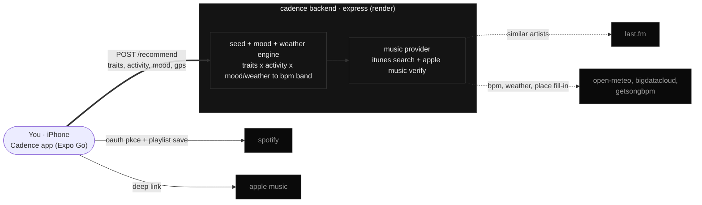

# Cadence

Personality-anchored, activity-aware music recommendations that sharpen with every listen — and read the room: your stated mood, local weather, place, and time of day.

Cadence runs a short Big Five personality assessment (or skip it entirely), maps your trait profile plus a stated activity (deep work, calls, creative, commute, workout, wind-down) to a target tempo/energy band, pulls matching tracks from real artists across every genre in that band — including artists and similar artists you actually listen to on Spotify — and re-ranks them live from your feedback (skips, likes, completions). Favourited tracks build "My Picks," a cross-session catalog you can save as a real Spotify playlist at any point, with a description that tells the story of the session it came from.

## Status
Working prototype: Expo app (physical phone via Expo Go) + a small Express backend deployed on Render.
- Onboarding → recommendation → feedback loop: working. Personality can be skipped in favour of mood/weather/time alone.
- In-app 30s preview playback with auto-advancing queue: working.
- Save the current session's queue, or the whole cross-session "My Picks" catalog, as a real Spotify playlist (full songs) with a humanized description and a generated cover: working.
- Refresh Playlist (re-pull fresh tracks for the same mode, capped at 10 refreshes/session) and four selectable colour themes: working.
- Full-song playback *inside* the app, and background/lock-screen playback controls: need a dev build — see `app/V3-ACTION-PLAN.md`.

## Full functional flow

What actually happens, screen by screen, from opening the app to saving a playlist:

### 1. Launch
A brief branded title card (front page) shows for about two seconds on every launch, then the app checks whether a personality profile is already saved on-device. First time ever, or after "Test Again," it goes to onboarding; otherwise it goes straight to the main playlist screen.

### 2. Onboarding (first launch, or after "Test Again")
- An intro screen explains the quiz takes about a minute, with a **Start** button and a **Skip** link (skipping saves a neutral personality profile and jumps straight into the main app — the recommendation engine still works fine, just driven by activity/mood/weather instead of personality).
- The quiz itself is 10 yes/no-style prompts ("I am the life of the party," etc.), one at a time, answered on a 5-point agree/disagree scale. Which 10 prompts you get, and their order, is randomized per person. A **Skip** button stays available in the corner throughout, and **Back** steps to the previous question (or back to the intro screen from question 1) at any point.
- After the last question, a results screen shows your Big Five (OCEAN) breakdown as a bar graph with a short description per trait, plus a **Build My Playlists** button that saves the profile and moves into the main app.

### 3. Main playlist screen
- A row of activity chips at the top (Deep Work, Calls, Creative, Commute, Workout, Wind-down) — tapping one starts a session.
- The first pick each session (session = until you force-close the app) prompts for **mood**: multi-select feeling bubbles plus an optional free-text box, then **Build My Playlist**. This mood reading, plus your device's local weather and time of day, nudges the target tempo alongside your personality.
- The app then shows a generated "session banner" (an abstract art piece colored by your mood, with the date/time/weather/place underneath) and a track feed — a ranked list of real tracks in your target BPM range. Tapping a track plays a 30-second preview; tapping the heart favourites it (adding it to both the session's queue and the persistent "My Picks" catalog); tapping the ✕ removes it and swaps in a fresh one from a held-back reserve pool, no extra network call needed.
- Every skip/like/completion you make live-adjusts a Bayesian blend between your personality-driven starting tempo and what you're actually responding to — the "% Personality" number shown on screen drops as your own feedback outweighs the initial guess.
- **Refresh Playlist** re-pulls a new batch of tracks for the same activity/mood, excluding everything already shown this session (capped at 10 refreshes).
- **My Picks**, a horizontal strip below the feed, holds every track you've ever favourited across all activities and refreshes this session — not just the current one. Tap a pick to open it in Apple Music; hold and drag to reorder; hold still to reveal a ✕ directly on the album art, tap it to remove. A **Save My Picks to Spotify** button turns the whole catalog into a real playlist whenever you're ready, independent of whatever activity is currently open.
- The current session's queue (favourited tracks for *this* activity) can also be saved on its own via the queue panel — tap the queue icon in the bottom bar, then **Save Queue to Spotify**.
- Either save flow: connects Spotify if you haven't already (PKCE OAuth, opens Spotify's own sign-in), matches each track to Spotify by title/artist, creates a private playlist named after the activity + mood (e.g. "Cadence — Deep Work, Energetic"), writes a description narrating when/where/what the weather was/what tempo it's tuned to, and uploads a generated square cover image matching the session banner's art.

### 4. Profile screen
Reached via the "Profile" link in the top bar.
- A personality placard at the top — tap it to see the full OCEAN bar-graph breakdown again, with buttons to go back to Profile or straight to the playlist screen.
- **Test Again** retakes the quiz from scratch. **Theme** opens a picker with four colour themes (Black Bolt, Pink, Cyan, Purple), applied instantly and remembered across launches.
- Below that, **Your Playlists** lists every playlist you've saved to Spotify from this device, most recent first. Tapping one shows its full track list (each still playable as a 30s preview) and a link to open it directly in Spotify.

## Architecture at a glance



The client (Expo app) is the hub: it runs the quiz and re-ranking on-device, calls the backend for track discovery, and talks to Spotify/Apple Music directly for playback and saving — the backend never touches your Spotify account or the tracks you actually play, only the search/rank pipeline.

## How it works
1. **Assessment (optional)** — a randomized 10-item Big Five short form (drawn from a Mini-IPIP-style 20-item pool: one regular + one reverse-scored item per trait, both which pair and their order randomized per test taker) → normalized OCEAN vector. Skip is available both before starting and mid-quiz, saving a neutral vector instead, which mathematically produces zero personality-driven shift in the seed engine — the playlist is then driven by activity + mood + weather + time alone. The OCEAN bar-graph breakdown is viewable again any time by tapping the personality placard in Profile.
2. **Mood** — a one-time-per-session prompt (multi-select bubbles + free text) analyzed on the backend via a hand-built valence/arousal lexicon (circumplex model of affect), with negation handling.
3. **Weather + place** — given device location, the backend pulls current conditions (Open-Meteo, free/no-key) and a human place name (BigDataCloud reverse geocoding, free/no-key), both folding into the tempo nudge and the playlist's story.
4. **Seed engine** — trait vector × activity × mood/weather → target tempo band + the full genre seed pool for that activity (not just one random pick), with a human-readable "why" per adjustment.
5. **Cross-genre discovery** — the backend searches every genre in the seed pool, plus (if Spotify is connected) your real top Spotify artists and their real similar artists via Last.fm — genuine "adjacent artist" data, since Spotify closed its own Related Artists API in Nov 2024 and iTunes never had one. Results are merged, filtered for stock/library-music junk (generic-titled tracks that flood searches like "workout"), deduped so no artist repeats, sorted by BPM proximity, and verified against Apple Music availability so every track shown is actually playable/linkable. Source is iTunes Search only — Deezer was tried first but dropped after live data showed 75-100% Apple Music match failures for niche/instrumental genres (see `docs/music-data-layer.md`); iTunes tracks carry their Apple Music URL directly from the same search that found them.
6. **Re-ranking** — a confidence-weighted Bayesian blend (stays on-device — it's just re-sorting already-downloaded tracks, no need for a network round trip) shifts weight from the personality prior to observed behaviour as feedback accumulates; the current prior weight (λ) is shown live. See `docs/technical-appendix-bayesian-blending.md`.
7. **Refresh** — re-pulls a fresh batch for the same mode, excluding every track already shown this session so it doesn't just re-serve the same results (iTunes search ranking is deterministic); capped at 10 refreshes per session.
8. **My Picks + save** — favourited tracks accumulate into a persistent, cross-activity/cross-refresh catalog (independent of whichever single activity's queue is open), reorderable by drag, removable via a tap-and-hold X shown directly on the album art. One tap creates a real Spotify playlist via PKCE auth — either from the current session's queue or from the whole My Picks catalog — named e.g. `Cadence — Deep Work, Energetic`, with a description narrating when/where/how it was made and a generated cover image.
9. **Themes** — four selectable colour themes (Black Bolt plus Pink/Cyan/Purple, each paired with a true complementary accent), persisted across launches and applied app-wide via a React context.

## Repo layout
- `app/` — the Expo / React Native client
  - `App.js` — theme + personality profile persistence, top-level navigation
  - `src/OnboardingScreen.js` — the Big Five quiz (intro → 10 randomized prompts → OCEAN results)
  - `src/PlaylistScreen.js` — activity picker, mood prompt, track feed, queue, refresh, Spotify save
  - `src/MyPicksStrip.js` — the cross-session favourites catalog (tap/hold-drag-reorder/hold-still-to-remove gestures)
  - `src/ProfileScreen.js`, `src/TraitGraph.js`, `src/PersonalityPlacard.js` — profile, OCEAN graph, playlist history
  - `src/theme.js`, `src/traits.js` — shared theme presets and Big Five trait metadata
  - `src/SessionBanner.js`, `src/CoverArt.js` — generated mood/weather art, on-screen banner and the square Spotify cover composition
  - `src/engine/` — `bayes` (re-ranking, stays on-device), `spotify` (OAuth + playlist save + top-artist fetch, stays on-device), `appleMusic` (single-track deep link)
  - `src/config.js` — points the client at the deployed backend URL
  - `V3-ACTION-PLAN.md` — path to full-song in-app playback (Spotify Remote SDK + dev build)
- `server/` — the Express backend (deploy target: Render, see `server/DEPLOY.md`)
  - `index.js` — the `POST /recommend` pipeline
  - `engine/` — `seedEngine`, `moodEngine`, `weather`, `musicProvider` (iTunes search, junk filter, dedup, BPM proximity sort), `itunes`, `appleMusicResolve` (availability verification), `getSongBpm`, `lastfm`
- `docs/` — product spec and technical appendices
- `CLAUDE.md` — architecture/instructions for AI-assisted development on this repo; the most current single source of truth for how the pieces fit together

## Docs
- `docs/product-spec-v0.2.md` — product spec (predates the backend migration — architecture details there are stale, trait/activity model is still accurate).
- `docs/music-data-layer.md` — provider evaluation; why Spotify's feature endpoints, Deezer's India catalog, and eventually Deezer entirely became unavailable, and the iTunes-only fallback used today.
- `docs/technical-appendix-bayesian-blending.md` — the prior/posterior blend that fades personality as evidence grows.
- `docs/technical-appendix-cross-bucket-transfer.md` — trait-mediated transfer for sparse activity buckets.
- `server/DEPLOY.md` — how to deploy the backend to Render, including required env vars.

## Run it

**Backend** (needs to be deployed or running locally first — see `server/DEPLOY.md`):
```
cd server
npm install
npm start
```

**App**, pointed at your backend URL in `app/src/config.js`:
```
cd app
npm install
npx expo start --tunnel   # or `npx expo start` if your phone shares the same Wi-Fi (LAN mode)
```
Scan the QR with Expo Go on a physical phone.

### If `--tunnel` fails (`ERR_NGROK_3200` / `failed to start tunnel` / `remote gone away`)

`@expo/ngrok` bundles a deprecated ngrok v2 agent binary that ngrok's backend now rejects outright — this happens even with a valid ngrok account authtoken configured for it, because Expo CLI's tunnel integration uses its own hardcoded token/domain (`exp.direct`), not your local ngrok config, and the failure is protocol-level (v2 agent, not a token problem). Two ways out, in order of how much they actually fix vs. work around:

**Quick workaround — LAN mode** (phone and computer must share Wi-Fi):
```
npx expo start          # no --tunnel
```

**Real fix — swap in a modern ngrok v3 binary + tell Metro its public address.** Binary-swapping alone isn't enough (v3 rejects the v2-style YAML config `@expo/ngrok` generates for it), so this pairs a *standalone* ngrok v3 process with Expo's own `EXPO_PACKAGER_PROXY_URL` env var, which takes priority over every other URL-source Expo CLI would otherwise use:
```
brew install ngrok
ngrok config add-authtoken <your token>          # free account at ngrok.com

# terminal 1 — the tunnel
ngrok http 8081

# terminal 2 — Metro, told its own public address so the manifest
# it serves embeds the real ngrok URL instead of 127.0.0.1:8081
# (which Expo Go can't reach, and naively substituting just the
# hostname back in produces an invalid "ngrok-host:8081" combo,
# since ngrok's HTTPS edge doesn't listen on port 8081)
EXPO_PACKAGER_PROXY_URL=https://<your-subdomain>.ngrok-free.dev npx expo start -c
```
Grab your ngrok URL from the first terminal's output, or `curl -s http://127.0.0.1:4040/api/tunnels`. Enter `exp://<your-subdomain>.ngrok-free.dev` manually in Expo Go (or scan a QR code encoding that same URL). Both processes need to stay running, and ngrok's free tier hands out a new random subdomain each time the tunnel restarts.

## Tests
Both packages use Node's built-in test runner, covering the pure recommendation math (Bayesian blending, seed targeting, mood analysis):
```
cd app && npm test
cd server && npm test
```

## Music-data findings (validated during build)
- **Spotify** closed its recommendation/audio-feature/related-artist endpoints to new apps (Nov 2024); playlist-write and top-artists (`user-top-read`) remain open and require Premium for playback-affecting features.
- **Deezer** was tried first (native BPM) but dropped entirely: resolving Deezer tracks to a verified Apple Music match failed 75-100% of the time for niche/instrumental genres in production, sometimes returning zero playable tracks for focus-style modes.
- **iTunes Search API** is the sole track source now: free, no auth, works from India, 30s previews, direct Apple Music links carried from the same search that found the track (verified by construction, zero drop rate) — no native BPM (filled in via GetSongBPM) and no ISRC (the public Lookup API doesn't expose one, despite some older docs claiming otherwise — verified against a live response).
- **Last.fm** is the free source for real similar-artist data now that Spotify's is gone — `artist.getSimilar`, free API key for personal use.

## Known limitations
- Full songs play only after saving to Spotify (or via the deferred in-app dev-build path); in-app playback is 30s previews.
- Background audio and lock-screen/Control Center transport controls need a real Expo dev build — `expo-av` (the Expo-Go-compatible player) never wires up iOS's Now Playing / remote command APIs.
- iTunes-sourced tracks lack ISRC (Spotify matching is by title+artist, so expect some misses).
- Apple Music listening-history personalization isn't built — needs a paid Apple Developer Program account + hosted MusicKit auth page. `app/src/engine/appleMusic.js` only does one-way deep-linking, no auth.
- Render's free tier sleeps after 15 minutes idle; the first request after that takes 30-60s to wake up.
