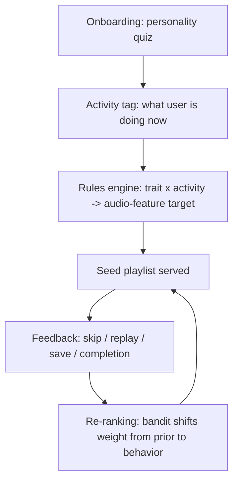

# Cadence — Product Spec v0.1
*Personality-anchored, activity-aware music recommendations that sharpen with every listen*
*(codename, not final branding)*

**North star:** skip-rate declines session-over-session within an activity bucket, without manual re-tagging.

## Problem & Why Now
- **Cold start is generic.** Spotify/Apple/YouTube personalize from listening history and real-time mood/context signals — powerful, but built entirely on behavior. New users, new devices, or a shift in activity all reset to bland defaults.
- **No trait anchor.** None of the major platforms ask *who you are* before recommending — everything is inferred, nothing is declared.
- **Gap to fill:** a layer that starts from personality + stated activity, then hands off to behavior-driven learning as data accumulates — cold-start speed now, long-run accuracy later.

## Goals / Non-Goals
- **Goal:** meaningfully better first-session recommendations than pure collaborative filtering, improving continuously via feedback.
- **Goal:** personality's influence fades as behavioral signal grows — it's a bootstrap, not a permanent label.
- **Non-goal (v1):** new streaming catalog or playback infra — sits on top of Spotify/Apple Music APIs.
- **Non-goal (v1):** replacing existing mood features — this is a complementary layer.

## Core Loop

## Feature Breakdown

**P0 — MVP**
- **Personality quiz:** Big Five-based, 10–15 items, ~2 min — more psychometrically defensible than MBTI for this use case
- **Activity tag:** manual selector (deep work / calls / creative / commute / workout / wind-down)
- **Seed engine:** rules mapping {trait scores × activity} → target audio-feature range (tempo, energy, valence, acousticness) via Spotify's audio-features API
- **Playback:** delegated to Spotify/Apple SDK, not rebuilt
- **Feedback capture:** skip, replay, save, completion %, thumbs up/down
- **Adaptive re-ranking:** bandit model; personality-prior weight decays as behavioral data accumulates

**P1**
- **Auto-activity detection:** calendar/location/motion inference; manual tag becomes override, not requirement
- **Per-activity taste vectors:** separate learned profile per activity bucket instead of one global taste
- **Trait re-calibration:** periodic short re-test; any silent trait drift from behavior must stay visible/editable to the user — trust risk otherwise

**P2**
- **Wearable signal:** heart rate/stress input for real-time energy tuning
- **Explainability:** "why this track" surfaced (trait + activity + feature)
- **Social layer:** opt-in taste comparison with friends

## Recommendation Engine
- **Cold start:** deterministic rules engine (OCEAN scores × activity → audio-feature vector) — cheap, explainable
- **Warm state:** contextual bandit (e.g. LinUCB); context = activity + time + recent skips, reward = engagement signal
- **Long run:** collaborative filtering across the user base; personality becomes one input feature, not the primary driver

## Feedback Signals (by reliability)
- **Explicit** (like/dislike/save) — strong signal, low volume
- **Skip** (<X sec) — strong negative
- **Completion/replay** — strong positive
- **Session timing/length** — secondary, used for context inference

## Success Metrics
- D7/D30 retention
- Skip-rate trend within an activity bucket (should decline over sessions)
- Session length, completion rate
- % of sessions using the adaptive rec vs. falling back to manual search
- NPS / qualitative signal

## Risks & Assumptions
- **Personality→music correlation is real but weak at the individual level** — treat as a cold-start prior, not a promise; don't oversell precision in-product
- **Platform API dependency** — Spotify Developer Terms may restrict recommendation-layer use cases; needs a ToS check before build
- **Tagging fatigue** — if users stop manually tagging activity, cold start degrades; auto-detection is a fast-follow, not v1
- **Trust risk** — silent personality updates from behavior without user visibility

## Phasing
- **V1:** manual activity tag + Big Five quiz + rules engine + feedback capture
- **V2:** auto-activity detection + per-activity taste vectors + bandit re-ranking
- **V3:** wearable input + explainability + social layer
